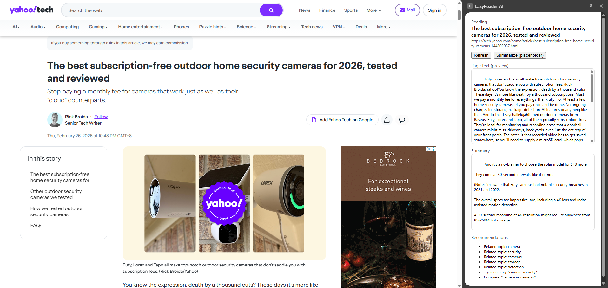

# LazyReader AI v0.1.0

Chrome extension that helps summarizes any webpage you are on. Currently it is v0.1.0 using basic NLP with keyword tokenization so its blazing fast.
Just a for fun project I will update from time to time, main objective is to tinker with WASM, WebGPU and mini LLMs models.

## Features
- Side panel UI (Chrome MV3)
- Reader-mode text extraction (Mozilla Readability)
- Fast local extractive summarization
- Local keyword-based recommendations

## Screenshot


## Requirements
- Node.js 18+ (recommended)
- Google Chrome (MV3 + Side Panel support)

## Install / Build
```bash
npm install
npm run build