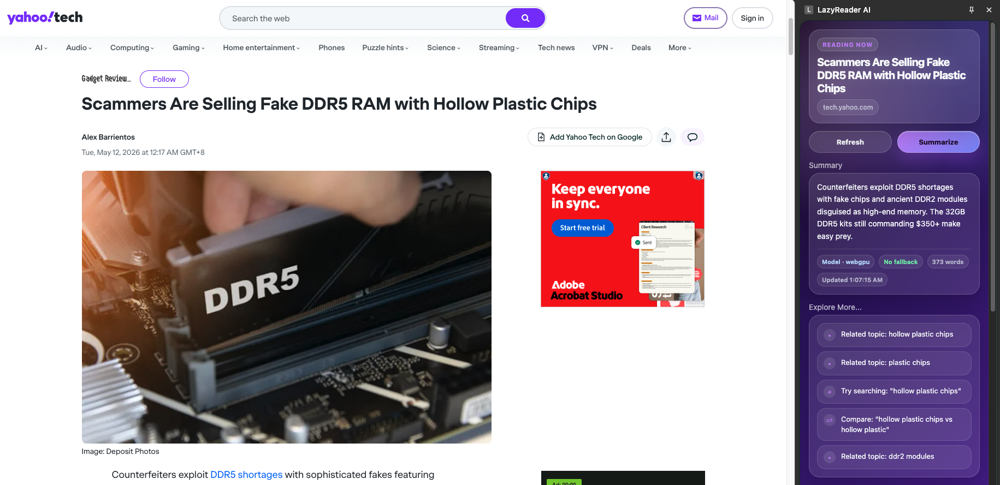

# LazyReader AI

LazyReader AI is a Chrome side panel extension that helps you quickly understand long webpages by extracting readable page text, generating a summary, and suggesting related topics to explore next.

## Screenshot
Current release: `v1.0.0`


## v1.0.0 Summary

Previously, v0.1.0 is just a for-fun project to thinker with local mini LLMs model through WASM and WebGPU. Now, we have our first usable relase v1.0.0 of the extension with a mini local LLM model. 

This version focuses on a simple local reading workflow:

- Open LazyReader AI from the Chrome toolbar.
- Read the current webpage inside the Chrome side panel.
- Generate a concise AI summary.
- View related topics and search ideas under **Explore More...**
- Inspect runtime diagnostics such as WebGPU, WASM fallback, model status, and backend information.

The goal of `v1.0.0` is to provide a reliable local-first reading assistant with a clean side panel UI.

## Features
- The extension summarizes the extracted page text. If the model summary fails, LazyReader AI falls back to a basic extractive summary so the user can still get a result.
- Provides topic recommendation through "Explore more..." segment after a summary is generated. (**Note**: This is done using keyword/phrase extraction currently. Model implementation is too unstable and returns gibberish result lol).
- The Diagnostics section shows useful runtime information. (Ex. Preferred backend, Active backend, WebGPU availability, Transformers.js injection status, Fallback status). This section is mainly useful for development and debugging.

### Modern side panel UI

`v1.0.0` includes a refreshed side panel interface with:

- Purple gradient background
- Card-based layout
- Loading states
- Summary metadata
- Explore More recommendations
- Page text preview
- Collapsible diagnostics section

Note: The code is also designed in a way to support themes and color change next time. Will plan for it.

## Installation

LazyReader AI `v1.0.0` is distributed as a zip file named:

```txt
Release_v1.0.0.zip
```

This zip file contains the production `dist` build of the Chrome extension.

> Important: Chrome cannot load the zip file directly through **Load unpacked**. You must unzip it first, then select the extracted folder.

## Download v1.0.0

1. Go to the project’s GitHub repository.
2. Open the **Releases** section.
3. Find release `v1.0.0`.
4. Under **Assets**, download:

```txt
Release_v1.0.0.zip
```

5. Save the zip file somewhere easy to find, such as your Desktop or Downloads folder.

## Import into Chrome using Load unpacked

1. Unzip `Release_v1.0.0.zip`.

2. After extracting, you should have a folder that contains files similar to:

```txt
manifest.json
index.html
background.js
content.js
ort/
assets/
```

3. Open Google Chrome.

4. In the address bar, go to:

```txt
chrome://extensions
```

5. Turn on **Developer mode**.

   The toggle is usually in the top-right corner of the Extensions page.

6. Click **Load unpacked**.

7. Select the extracted extension folder.

   Select the folder that directly contains:

```txt
manifest.json
```

   Do not select the original `.zip` file.

8. LazyReader AI should now appear in your Chrome extensions list.

9. Pin LazyReader AI to your Chrome toolbar if you want quick access.

10. Open a readable webpage, then click the LazyReader AI extension icon to open the side panel.

## Usage

1. Open a webpage you want to summarize.
2. Click the LazyReader AI extension icon.
3. The side panel will open.
4. Wait for the page text preview to load.
5. Click **Summarize**. (It should load automatically without you clicking tbh)
6. Read the generated summary.
7. Use **Explore More...** to continue researching related topics.

## Troubleshooting

### Chrome says the manifest file is missing

You probably selected the wrong folder.

Make sure you select the extracted folder that directly contains:

```txt
manifest.json
```

Do not select a parent folder if `manifest.json` is inside another nested folder.

### The extension does not update after replacing files

Go back to:

```txt
chrome://extensions
```

Then click the reload button on the LazyReader AI extension card.

### The page has no summary

Some pages may not expose enough readable text to the extension.

Try using LazyReader AI on a normal article, blog post, documentation page, or news page.

Chrome internal pages such as the following cannot be summarized:

```txt
chrome://extensions
chrome://settings
chrome://newtab
```

### WebGPU is not available

LazyReader AI can still run using WASM fallback.

Performance may be slower depending on your device.

### First run is slow

The first model run may take longer while the browser initializes the runtime and model assets.

Later runs should generally be faster.

## Development notes

This project is currently focused on a local-first Chrome extension workflow.

The v1 architecture is organized around:

```txt
src/
  core/
  ui/
  features/
    model/
    preview/
    recommendation/
    runtime/
    summary/
  platform/
  shared/
```

The production Chrome extension build is generated into:

```txt
dist/
```

For `v1.0.0`, the GitHub release zip should contain the built `dist` output, not the raw source files.

## Roadmap

Possible future improvements:

- Settings page
- Theme selector
- Better recommendation generation (With model hopefully...)
- External model provider support (API support)
- More stable long-page summarization
- Chrome Web Store packaging
- Better error reporting